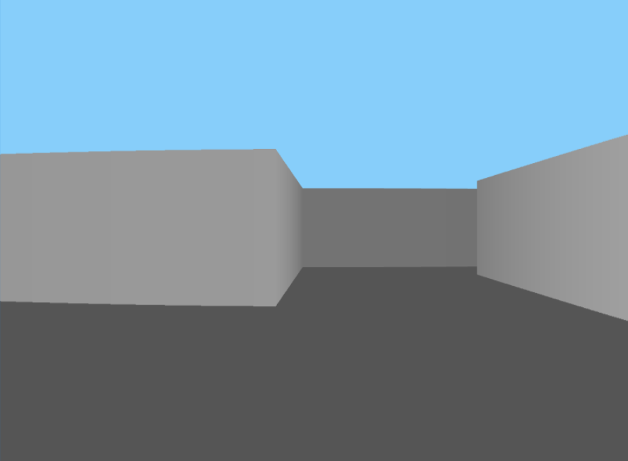

# Dungeon flee game

Game based on [Excalibur](https://excaliburjs.com) game engine starter, built using Typescript 4 & Webpack 5.



Crawl in a dungeon, avoid enemies and reach the exit.

Use keys W, A, S, D to move.


## Start
```shell
nvm use 24
npm install
npm run start
```


## TODO
- [x] Hardwired test dungeon
- [x] Basic graphics
- [x] Walls collision and out of bounds check
- [/] Wall shade depending on orientation
- [ ] Add mouse horizontal rotation and strafe with A amd D keys
- [ ] Correct FOV distortion
- [ ] Pavement and floor shade depending on distance from viewer
- [ ] Basic sprites draw
- [ ] Wall textures
- [ ] Pavement and ceiling texture
- [ ] Vertical head bobbling when walking
- [ ] ZBuffer to clip sprites partially hidden by walls
- [ ] Dungeon random generation with cellular automata
- [ ] Minimap with player and his direction
- [ ] Clip to display partial minimap
- [ ] Doors opened by special crystals to be picked up
- [ ] Enemies
- [ ] Path calculation for enemies when seeking player
- [ ] Add an easy powerups system (decide what to enhance, for how much time, ...)
- [ ] Steps sound
- [ ] Background music
- [ ] Enemies and effects sounds

## Publishing

* Run `npm run build:dev` to produce Javascript bundles for debugging in the `dist/` folder
* Run `npm run build:prod` to produce Javascript bundles for production (minified) in the `dist/` folder

The `dist/` folder can be deployed to a static web host. We recommend [Netlify](https://netlify.com) or [GitHub Pages](https://pages.github.com/) since they are free to use.

